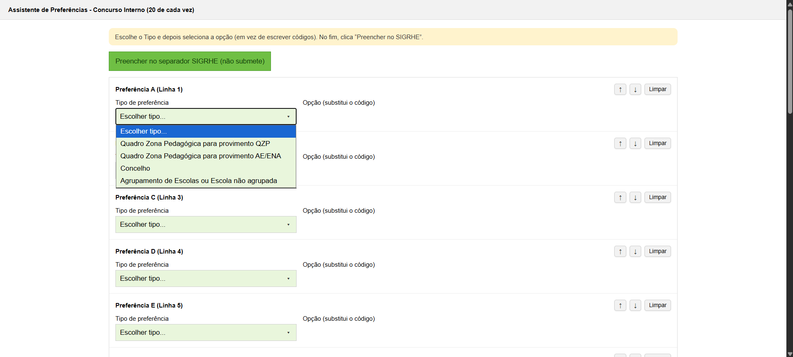
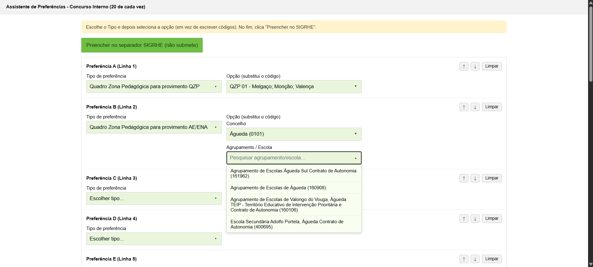
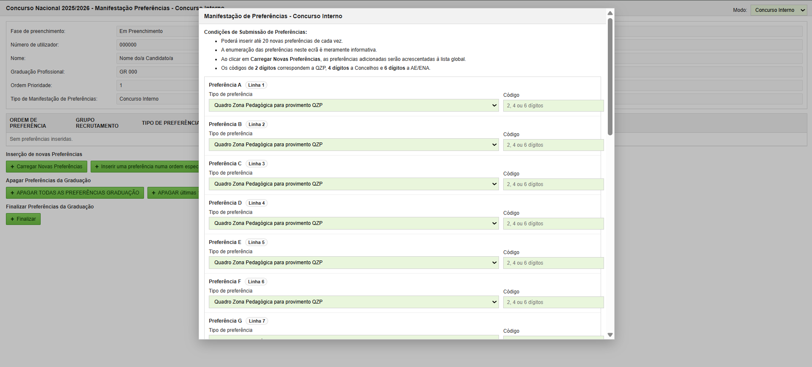
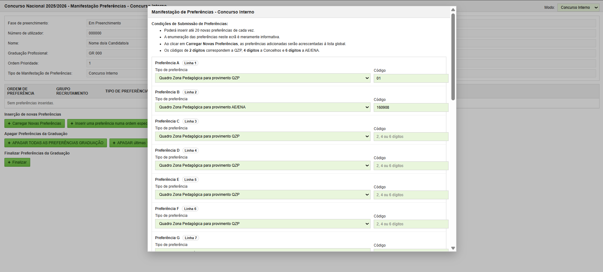
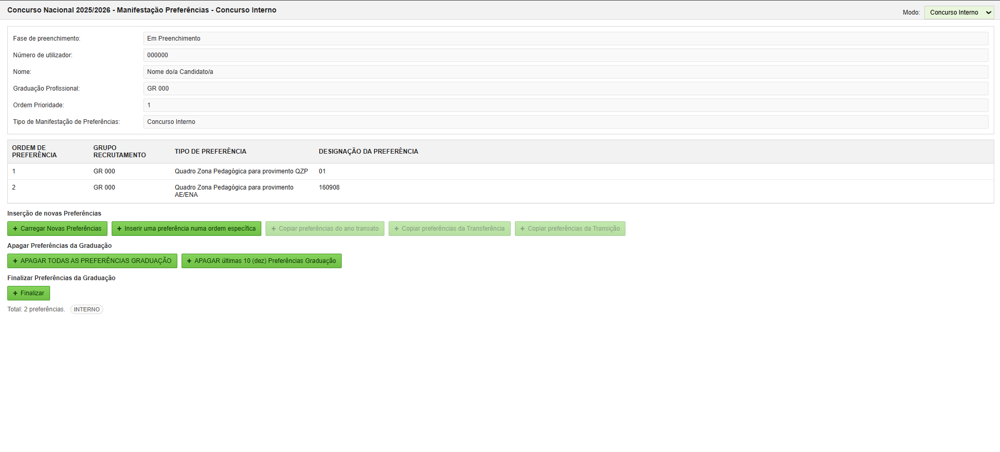

# SIGRHE Preference Assistant

A personal project exploring how a browser extension can reduce repetitive work when preparing teacher recruitment preferences in Portugal.

The project provides a **Chrome Extension (Manifest V3)** that supports both **Concurso Interno** and **Concurso Externo** workflows. It lets a user prepare up to 20 preferences through searchable selectors and then fills the corresponding fields in a **local demonstration page**. The final confirmation is intentionally left to the user.

> **Status:** prototype / portfolio project. The public version is configured only for a local demo environment (`localhost`) and does not connect to, submit data to, or modify the real SIGRHE platform.

## Why I built it

Teacher recruitment preference forms can involve repetitive selection of recruitment groups, QZP areas, municipalities and schools. I wanted to explore whether that workflow could be made faster and less error-prone while preserving human review before any final submission.

The core design principle is simple: **assist with repetitive input, do not automate the final decision or submission.**

## Main features

- Support for both **Concurso Interno** and **Concurso Externo** workflows.
- Prepare up to **20 preferences at a time**.
- Searchable selectors instead of manually entering codes.
- Support for recruitment groups, QZP areas, municipalities and schools/organisations.
- Reorder and manage preference rows before filling the form.
- Browser storage for extension state.
- Communication between the popup, extension page and content script.
- Local demo page that reproduces the relevant interaction flow for development and testing.
- User review remains mandatory before any final action.


## Demo

### Available preference types



*The assistant supports the different preference types available in the workflow, including QZP, municipality and school/organisation-based choices.*

### Build preferences using readable options



*Preference builder with searchable selectors for QZP areas, municipalities and schools, avoiding manual code entry.*

### Local test environment before filling



*Local demonstration form before the prepared preferences are transferred by the extension.*

### Automatic field filling



*The extension transfers the selected preference types and corresponding codes to the local form while leaving final confirmation to the user.*

### Resulting preference list



*Example of the prepared preferences loaded into the demonstration workflow, showing the resulting ordered list.*

## Project structure

```text
SIGRHE-Preference-Assistant/
├── extension/
│   ├── data/
│   │   ├── catalogo.json
│   │   └── qzp-grupos.json
│   ├── content.js
│   ├── manifest.json
│   ├── page.html
│   ├── page.js
│   ├── popup.html
│   └── popup.js
├── demo/
│   └── index.html
├── screenshots/
│   ├── 01-preference-types.png
│   ├── 02-preference-builder.png
│   ├── 03-demo-before-fill.png
│   ├── 04-demo-auto-filled.png
│   └── 05-preferences-loaded.png
├── .gitignore
└── README.md
```

## Architecture

The project is split into two parts:

1. **Chrome extension**
   - `popup.html` / `popup.js`: entry point for opening the assistant.
   - `page.html` / `page.js`: interface used to build and manage the preference list.
   - `content.js`: receives the prepared preferences and fills matching fields in the active demo page.
   - `data/`: catalogues used to map human-readable selections to the corresponding codes.

2. **Local demo page**
   - `demo/index.html`: self-contained page used to reproduce the relevant form behaviour without interacting with a production system.

## Technologies

- JavaScript
- HTML / CSS
- Chrome Extensions Manifest V3
- Chrome Storage API
- Chrome Tabs / Scripting APIs
- JSON data catalogues

## Running the demo

### 1. Start the local demo page

From the repository root, run a simple local HTTP server. For example, with Python:

```bash
cd demo
python -m http.server 8000
```

Then open:

```text
http://localhost:8000
```

### 2. Load the extension in Chrome

1. Open `chrome://extensions/`.
2. Enable **Developer mode**.
3. Click **Load unpacked**.
4. Select the `extension/` folder from this repository.
5. Keep the local demo page open.
6. Open the extension and launch the preference assistant.

## Safety and scope

This repository is intended as a **technical prototype and portfolio project**.

- The public version only has host permissions for `localhost` and `127.0.0.1`.
- It does not contain credentials or authentication data.
- It does not perform final submission actions.
- Users remain responsible for reviewing any generated or filled information.

## Limitations

- The public repository is configured for the included local demo, not the production SIGRHE website.
- The demo reproduces only the parts of the workflow needed to test the extension.
- Changes to the real platform's structure would require explicit adaptation and testing.

## Motivation and learning

This project was developed independently from an initial idea to simplify a real administrative workflow. It gave me practical experience in browser-extension architecture, DOM interaction, structured data handling, interface design and building a safe test environment before considering integration with a real system.

## Disclaimer

This is an independent personal project and is **not affiliated with, endorsed by, or an official tool of DGAE or SIGRHE**. Any names used to describe the workflow are included only to explain the context in which the prototype was designed.
